# Яндекс Умный дом [n-bord] для Stream Dock

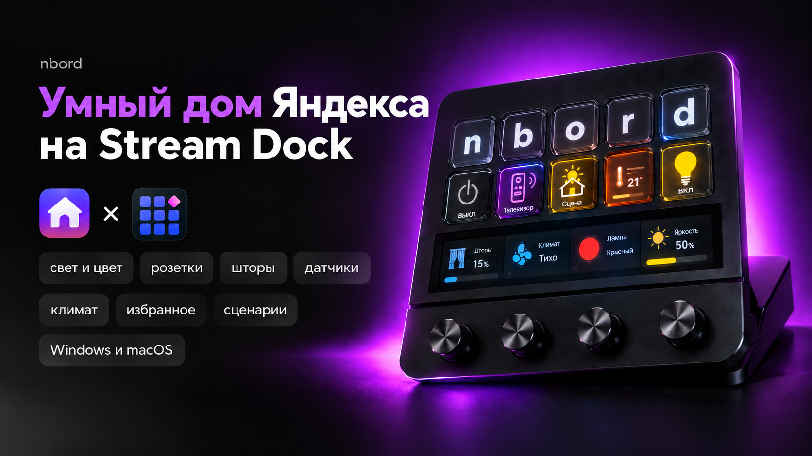

<p align="center">
  <a href="https://github.com/n-bord/yandex-smart-home-stream-dock/releases">
    
  </a>
  <a href="https://github.com/n-bord/yandex-smart-home-stream-dock/releases">
    
  </a>
  <a href="https://github.com/n-bord/yandex-smart-home-stream-dock/stargazers">
    
  </a>
  <a href="https://github.com/n-bord/yandex-smart-home-stream-dock/issues">
    
  </a>
</p>

<p align="center">
  
  
  
  
</p>

<p align="center">
  <a href="https://github.com/n-bord/yandex-smart-home-stream-dock/releases/latest">
    
  </a>
  <a href="https://github.com/n-bord/yandex-smart-home-stream-dock/releases/latest">
    
  </a>
  <a href="https://boosty.to/nbord">
    
  </a>
</p>

Неофициальный плагин для управления **Яндекс Умным домом** с устройств **Stream Dock** на **macOS и Windows**.

Основная идея проекта — вынести повседневное управление домом на физические кнопки, крутилки и информационные экраны Stream Dock, а для подробного управления использовать встроенную локальную панель.

**Версия:** `1.1.0`  
**Автор:** [n-bord](https://github.com/n-bord)  
**Репозиторий:** [github.com/n-bord/yandex-smart-home-stream-dock](https://github.com/n-bord/yandex-smart-home-stream-dock)

> **Неофициальный любительский проект.** Проект не связан с компанией Яндекс и сервисом «Умный дом» от Яндекса и не поддерживается ими. Все упомянутые товарные знаки принадлежат их правообладателям.

---

## Главное

- управление устройствами Яндекс Умного дома с **кнопок Stream Dock**;
- управление яркостью, температурой, шторами, вентиляцией, громкостью и другими параметрами с **крутилок**;
- отображение показаний датчиков и краткой сводки на совместимых информационных областях;
- запуск сценариев;
- управление ИК-пультами и телевизорами;
- отдельная локальная панель со всеми комнатами, группами и устройствами;
- история показателей датчиков;
- избранное, статистика, сортировка, скрытие устройств и диагностика;
- светлая и тёмная темы;
- интерфейс строится по фактическим `capabilities` устройства;
- встроенная авторизация через Яндекс в браузере с **Authorization Code + PKCE**;
- отдельные сборки и установщики для **macOS** и **Windows**;
- проверка обновлений через GitHub Releases.

---

# Скачать

Откройте [последний GitHub Release](https://github.com/n-bord/yandex-smart-home-stream-dock/releases/latest) и скачайте нужный архив:

| Платформа | Файл |
|---|---|
| macOS | `YandexSmartHome-StreamDock-v1.1.0-mac.zip` |
| Windows | `YandexSmartHome-StreamDock-v1.1.0-windows.zip` |

После скачивания **полностью распакуйте ZIP** перед запуском установщика.

---

# Установка

## macOS

1. Скачайте `YandexSmartHome-StreamDock-v1.1.0-mac.zip`.
2. Полностью распакуйте архив.
3. Запустите `INSTALL-MAC.command`.
4. Дождитесь сообщения об успешной установке.
5. Если Stream Dock не запустился автоматически — запустите его вручную.
6. Откройте **Настройки → Подключение → Войти через Яндекс**.

### Если macOS блокирует установщик

Текущий установщик не подписан сертификатом Apple Developer и не нотарифицирован Apple, поэтому Gatekeeper при первом запуске может показать предупреждение, что Apple не удалось проверить файл.

Если архив получен из официального GitHub Releases проекта:

1. один раз попробуйте открыть `INSTALL-MAC.command`;
2. откройте **Системные настройки → Конфиденциальность и безопасность**;
3. найдите сообщение о заблокированном файле;
4. нажмите **«Всё равно открыть» / Open Anyway**;
5. подтвердите запуск паролем или Touch ID, если потребуется.

Также можно попробовать **Control + клик → Открыть** в Finder.

> Не отключайте Gatekeeper целиком и не используйте `sudo spctl --master-disable` — для установки плагина это не требуется.

## Windows

1. Скачайте `YandexSmartHome-StreamDock-v1.1.0-windows.zip`.
2. Полностью распакуйте архив.
3. Запустите двойным кликом `INSTALL-WINDOWS.bat`.
4. Дождитесь сообщения об успешной установке.
5. Если Stream Dock не перезапустился автоматически — запустите его вручную.
6. Откройте **Настройки → Подключение → Войти через Яндекс**.

Технический файл `installer\_install.ps1` является частью установщика. Запускать его вручную не нужно.

Если Windows SmartScreen показывает предупреждение, разрешайте запуск только если архив скачан из официального GitHub Releases проекта.

---

# Подключение к Яндексу

## Рекомендуемый способ — «Войти через Яндекс»

Для обычного пользователя не требуется создавать собственное OAuth-приложение.

1. Откройте **Настройки → Подключение**.
2. Нажмите **«Войти через Яндекс»**.
3. Плагин откроет официальный экран Яндекс OAuth в браузере.
4. Выберите аккаунт и подтвердите доступ к просмотру и управлению устройствами умного дома.
5. После подтверждения браузер вернёт результат локальному backend плагина.
6. Плагин автоматически сохранит токен и проверит доступ к устройствам.

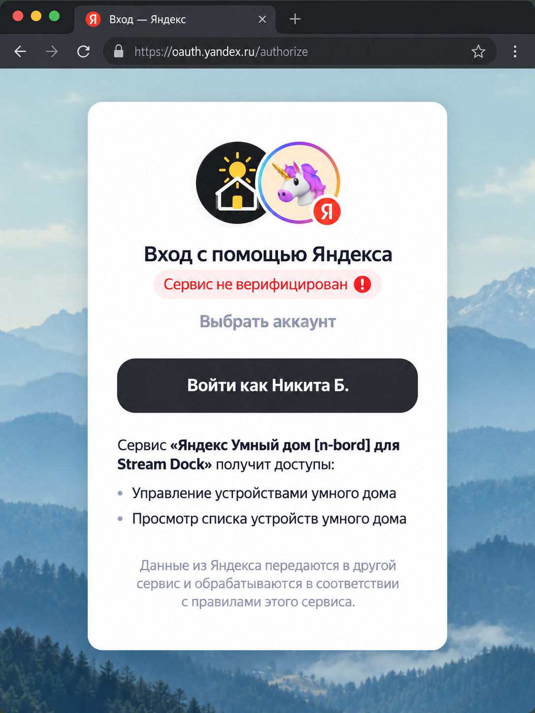

Используется **Authorization Code + PKCE**. `client_secret` в публичный плагин не встраивается.

Локальный callback:

```text
http://127.0.0.1:49407/oauth/yandex/callback
```

Если Яндекс возвращает срок действия токена, плагин показывает известную дату окончания. При истёкшем или отозванном доступе достаточно снова выполнить **«Войти через Яндекс»**.

> Refresh-token в текущем публичном релизе намеренно не сохраняется.

## Ручной OAuth-токен

Ручное подключение сохранено как альтернативный вариант для опытных пользователей.

Требуемые разрешения:

```text
iot:view
iot:control
```

В поле токена можно вставить сам `access_token` или полный URL результата OAuth с `access_token` и `expires_in`.

> **Никогда не публикуйте OAuth-токен** в Issues, скриншотах, логах или сообщениях.

---

# Stream Dock — основной функционал

## Как это выглядит на устройстве

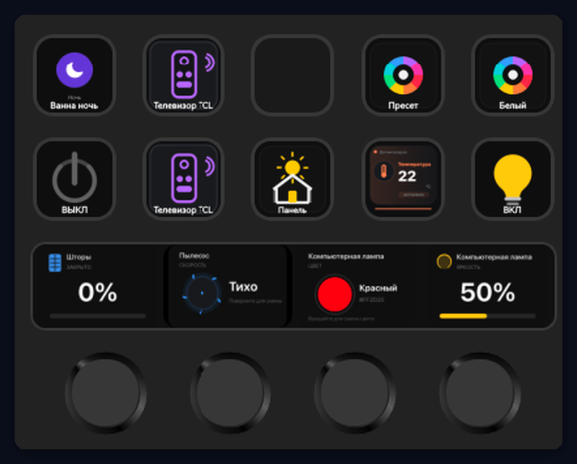

Плагин позволяет одновременно использовать обычные кнопки, информационные плитки и действия с крутилками.

## Доступные действия

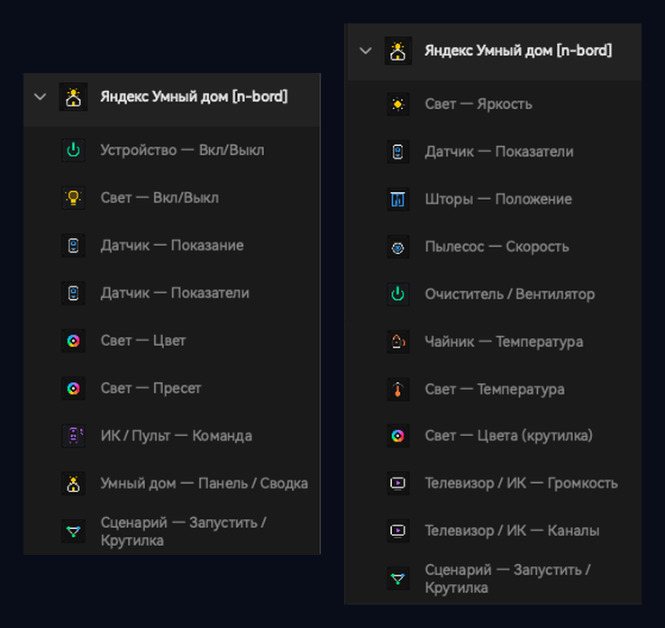

| Иконка | Действие | Для чего |
|---|---|---|
| 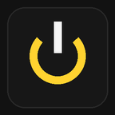 | **Устройство — Вкл/Выкл** | Питание совместимого устройства |
| 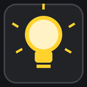 | **Свет — Вкл/Выкл** | Управление лампой или группой света |
| 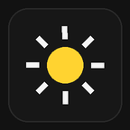 | **Свет — Яркость** | Регулировка яркости крутилкой |
| 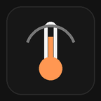 | **Свет — Температура** | Регулировка температуры белого света |
| 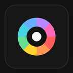 | **Свет — Цвет / Пресет** | RGB/HSV, температура и световые сцены |
| 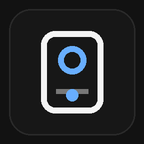 | **Датчик — Показание / Показатели** | Температура, влажность, CO₂, PM2.5 и другие свойства |
| 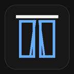 | **Шторы — Положение** | Изменение положения штор |
| 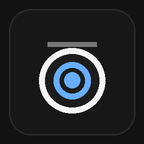 | **Пылесос — Скорость** | Поддерживаемые диапазонные параметры |
|  | **Очиститель / Вентилятор** | Скорость, режим и доступные параметры |
| 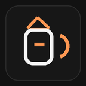 | **Чайник — Температура** | Изменение целевой температуры |
|  | **Телевизор / ИК** | Громкость, каналы и поддерживаемые команды |
| 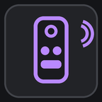 | **ИК / Пульт — Команда** | Команды устройств Яндекс Пульта |
| 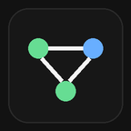 | **Сценарий — Запустить / Крутилка** | Запуск и выбор сценариев |
| 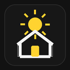 | **Умный дом — Панель / Сводка** | Открытие dashboard или информационная сводка |

> Доступность конкретных элементов управления определяется возможностями, которые устройство возвращает через API.

## Настройка кнопки и крутилки

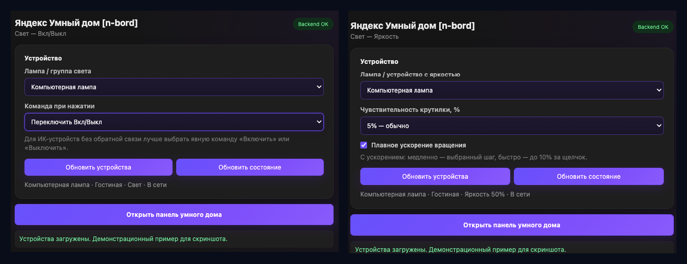

Для действий можно выбрать конкретное устройство и доступные параметры. Крутилки поддерживают изменение диапазонных значений и дополнительные действия по нажатию.

## Датчики

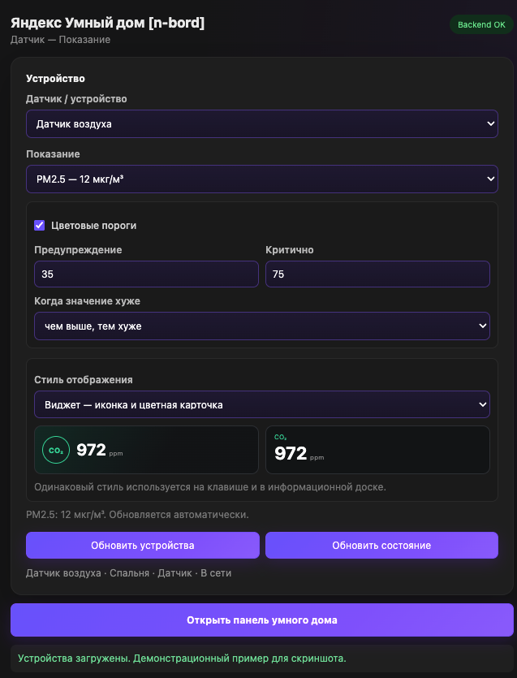

Поддерживаются числовые свойства устройства — например температура, влажность, CO₂, PM2.5, PM10, TVOC, батарея и другие значения, если они доступны через API.

## Примеры управления крутилками

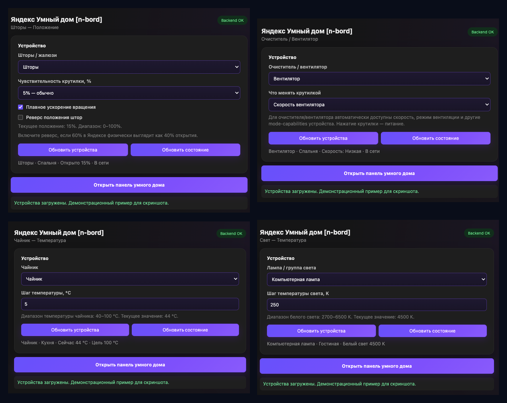

## Дополнительные действия

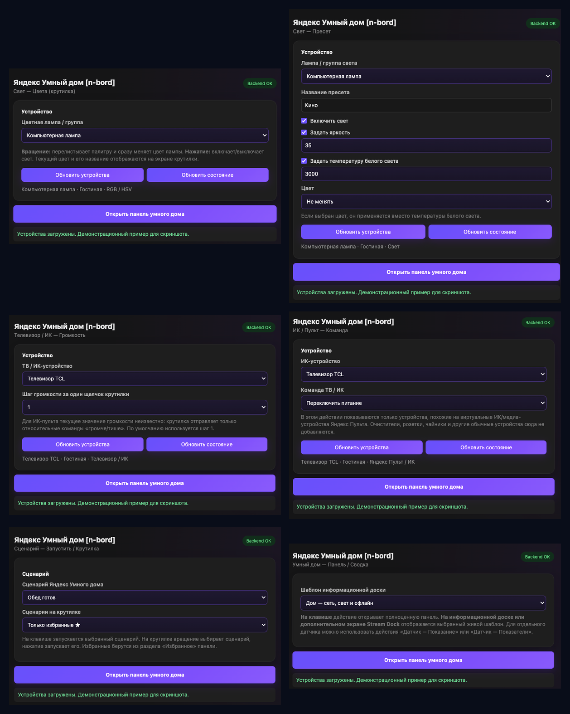

Доступны выбор цвета, световые пресеты, громкость, команды ИК-пульта, сценарии, открытие локальной панели и краткая сводка дома.

---

# Панель умного дома

Плагин включает отдельный локальный dashboard для подробного управления устройствами, группами и комнатами.

## Тёмная тема

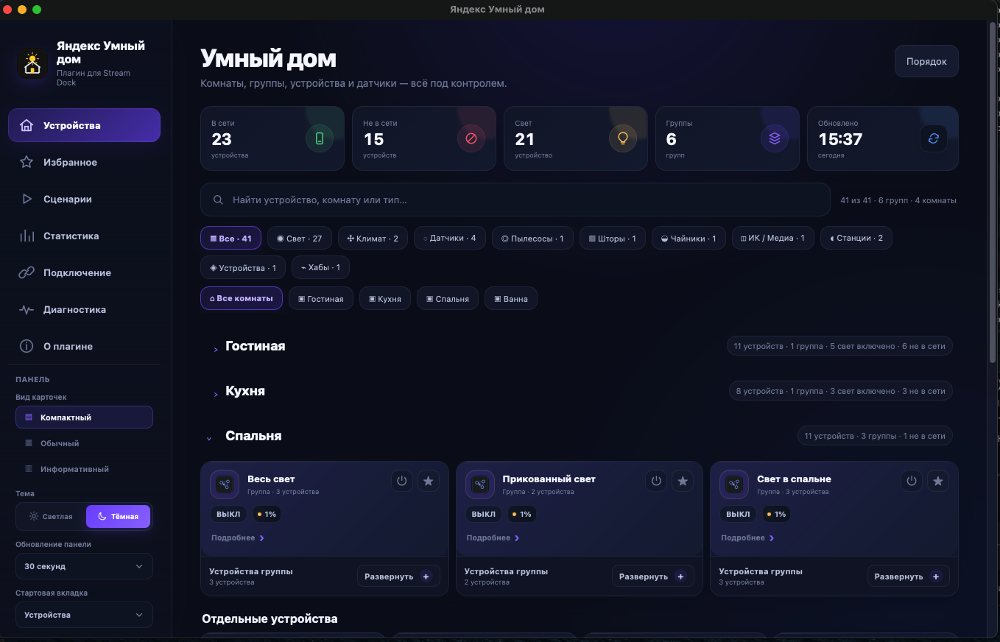

## Светлая тема

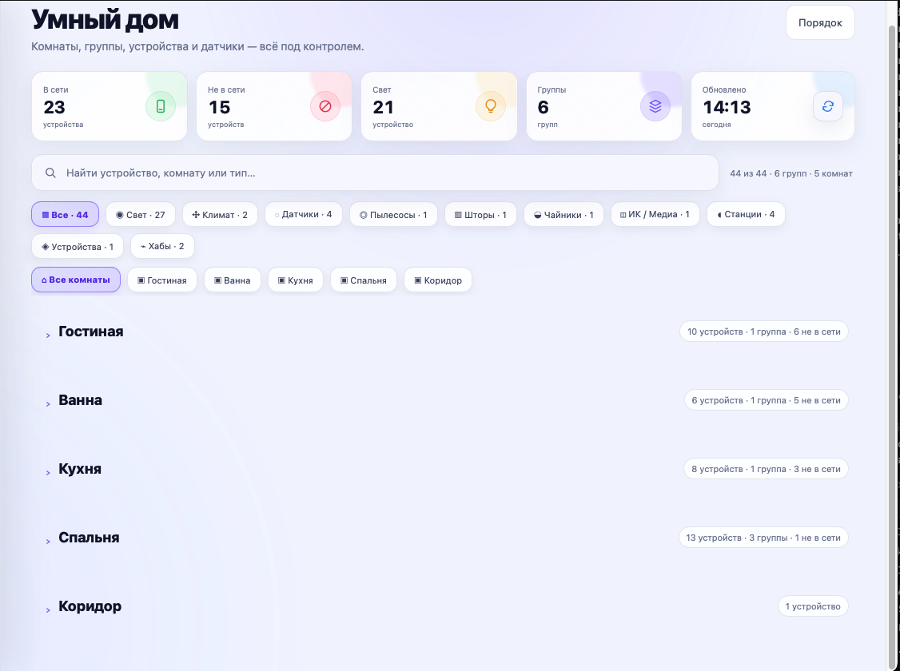

В панели доступны:

- комнаты, группы и отдельные устройства;
- поиск и фильтры;
- **Компактный / Обычный / Информативный** режимы карточек;
- ручной порядок комнат и устройств;
- отдельный порядок избранного и сценариев;
- скрытие устройств;
- mixed-state для групп;
- управление по фактическим `capabilities`;
- отдельный интервал обновления панели;
- запоминание состояния интерфейса.

На Windows панель открывается в отдельном app-окне Microsoft Edge, если Edge доступен; иначе используется браузер по умолчанию. Повторное нажатие на действие панели активирует существующее окно, а защита от повторного запуска не даёт создать несколько окон во время первоначальной загрузки.

---

# Подробное управление устройствами

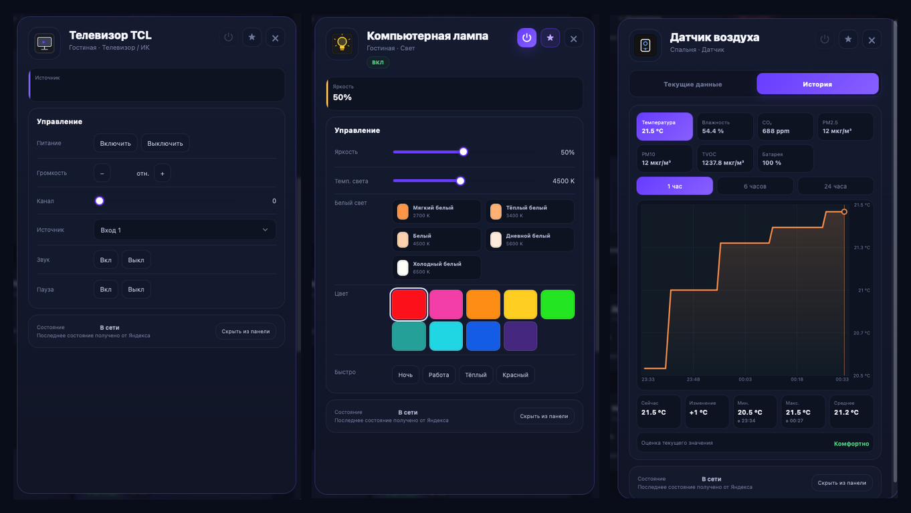

### Свет

- питание;
- яркость;
- температура белого света;
- RGB / HSV;
- доступные сцены и пресеты;
- управление группами света.

### Телевизоры и ИК

- питание;
- громкость;
- канал;
- источник;
- доступные `toggle` / `mode` команды.

### Датчики

- текущие показатели;
- история;
- минимум, максимум и среднее;
- изменение за период.

---

# История показателей

История числовых свойств собирается **локально на компьютере** после запуска плагина.

Доступны:

- `1 час`;
- `6 часов`;
- `24 часа`;
- график;
- текущее значение;
- изменение за период;
- минимум и максимум;
- среднее значение.

История может собираться не только для отдельных датчиков, но и для устройств с числовыми свойствами — например чайников или очистителей воздуха.

---

# Избранное, сценарии и статистика

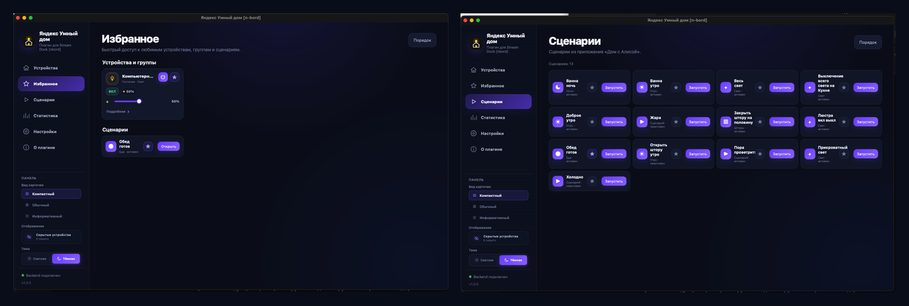

- избранные устройства, группы и сценарии;
- запуск сценариев Яндекс Умного дома;
- собственный порядок элементов;
- локальная статистика использования действий.

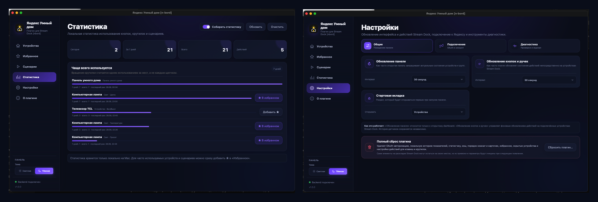

---

# Подключение, настройки и диагностика

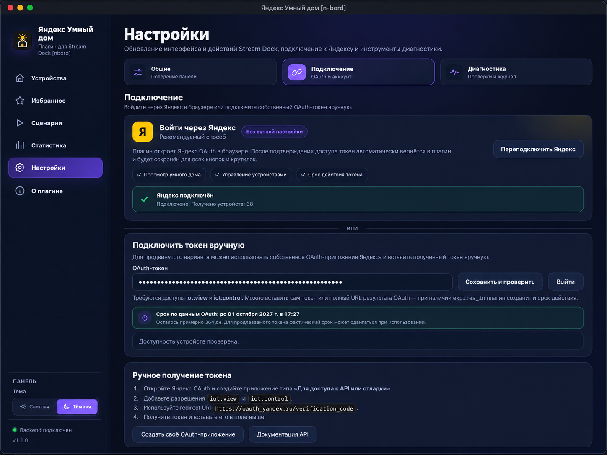

Можно:

- войти через Яндекс;
- использовать ручной OAuth-токен;
- настроить обновление панели;
- отдельно настроить частоту обновления кнопок и крутилок;
- выбрать стартовую страницу;
- проверить backend и соединение со Stream Dock;
- запустить диагностические тесты;
- просмотреть журнал;
- выполнить полный сброс данных.

---

# О плагине и проверка обновлений

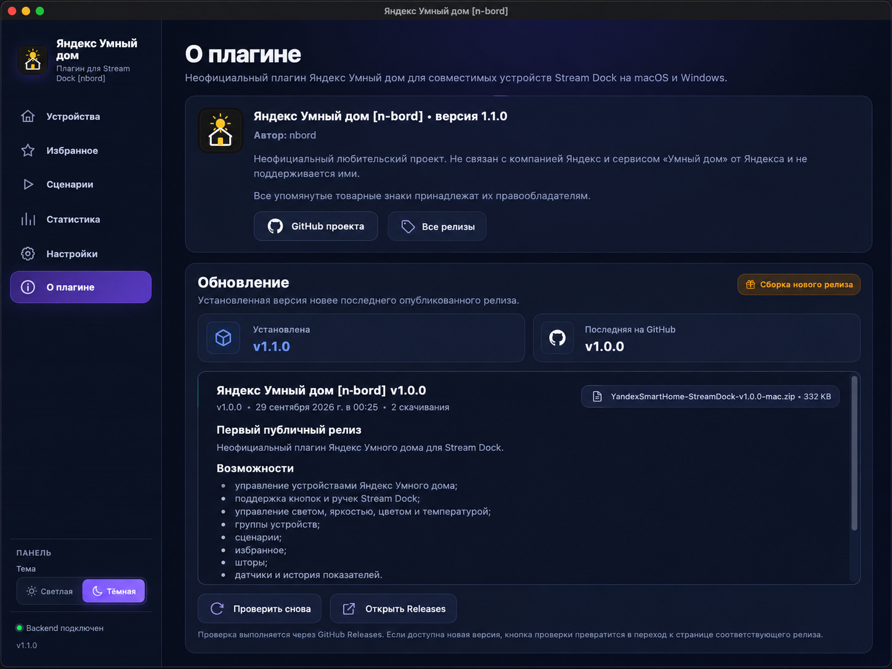

Во вкладке **«О плагине»** отображаются установленная версия, последний опубликованный GitHub Release, описание релиза и ссылки на проект и список релизов.

---

# Что нового в 1.1.0

- добавлена полноценная сборка для **Windows 10/11**;
- добавлены установщики `INSTALL-MAC.command` и `INSTALL-WINDOWS.bat`;
- встроена браузерная авторизация через Яндекс OAuth;
- используется Authorization Code + PKCE без `client_secret` в публичном коде;
- добавлено автоматическое сохранение токена и отображение известного срока действия;
- добавлена повторная авторизация при истёкшем или отозванном доступе;
- OAuth-сессия одноразовая и ограничена по времени;
- чувствительные OAuth-параметры маскируются в диагностике;
- ручной OAuth-токен сохранён как альтернативный способ;
- добавлена проверка обновлений через GitHub Releases;
- на Windows исправлены открытие браузера для OAuth, внешние ссылки, состояние ползунков и отображение выпадающих списков;
- на Windows добавлена защита от открытия нескольких окон панели при быстрых повторных нажатиях;
- улучшена обработка временных сетевых ошибок и резервный сетевой путь на Windows;
- добавлены отдельные инструкции и журналы установки для обеих платформ.

---

# Совместимость

## Поддерживается

- **macOS**
- **Windows 10 / Windows 11**
- совместимые устройства **Stream Dock**

Плагин не привязан к одной конкретной модели. Доступность действий зависит от контроллеров устройства: на моделях без крутилок используются клавишные действия, а на моделях с крутилками доступны соответствующие knob-действия.

## Протестировано

Основная конфигурация macOS:

- **macOS Sequoia 15.7.3**
- **Stream Dock 3.10.203.0730**
- **miraBox N4**

Windows:

- **Windows 11**
- **Stream Dock 3.10.203.0730**
- **miraBox N4**

На Windows дополнительно проверены установка через `INSTALL-WINDOWS.bat`, авторизация через Яндекс, работа панели, кнопок и крутилок, изменение яркости, внешние ссылки GitHub / Releases и сохранение настроек после перезапуска Stream Dock.

---

# Локальные данные

## macOS

```text
~/Library/Application Support/n-bord Yandex Smart Home Stream Dock/
```

## Windows

```text
%APPDATA%\n-bord\Yandex Smart Home Stream Dock\
```

История, статистика и пользовательские настройки хранятся локально.

## Полный сброс

Полный сброс очищает локальные данные плагина, включая OAuth-авторизацию, историю, статистику, кэш, избранное, скрытые устройства, пользовательский порядок, параметры интерфейса и временные диагностические данные.

---

# Диагностика

Если проблема возникла во время установки:

- macOS: приложите `install-mac.log`;
- Windows: приложите `install-windows.log`.

После запуска используйте **Настройки → Диагностика**.

При создании Issue желательно указать:

- версию плагина;
- macOS или Windows и версию ОС;
- версию Stream Dock;
- модель Stream Dock;
- тип проблемного устройства;
- шаги воспроизведения;
- скриншот;
- диагностическую информацию **без OAuth-токена**.

[Создать Issue](https://github.com/n-bord/yandex-smart-home-stream-dock/issues)

---

# Известные ограничения

- доступность функций зависит от `capabilities` конкретного устройства;
- локальная история начинает накапливаться только после установки и запуска плагина;
- macOS-установщик пока не подписан Apple Developer ID и не нотарифицирован, поэтому Gatekeeper может запросить ручное подтверждение первого запуска;
- Windows SmartScreen может предупредить о запуске неизвестного `.bat`/PowerShell-установщика;
- поведение сторонних устройств зависит от того, какие возможности они реально публикуют в API Яндекс Умного дома.

---

# Конфиденциальность

- OAuth-токен используется только для запросов к API Яндекс Умного дома;
- история и пользовательские настройки хранятся локально;
- refresh-token в текущем публичном релизе намеренно не сохраняется;
- диагностический журнал маскирует основные OAuth-токены и параметры;
- не публикуйте токены и другие секреты в Issues.

---

# Поддержать проект

Если плагин оказался полезен и вы хотите поддержать дальнейшую разработку:

<p>
  <a href="https://boosty.to/nbord">
    
  </a>
</p>

Поддержка не влияет на доступ к функциям плагина — проект остаётся публичным и доступным через GitHub.

---

# Лицензия

Исходный код проекта распространяется по лицензии [MIT](./LICENSE).

Лицензия распространяется только на код данного проекта и не предоставляет прав на товарные знаки, логотипы или материалы Яндекса, Stream Dock и других правообладателей.

---

# Автор

**nbord / n-bord**

- GitHub: [github.com/n-bord](https://github.com/n-bord)
- Проект: [github.com/n-bord/yandex-smart-home-stream-dock](https://github.com/n-bord/yandex-smart-home-stream-dock)

---

# Дисклеймер

**Яндекс**, **Умный дом**, названия продуктов и другие упомянутые товарные знаки принадлежат их правообладателям.

Этот проект является независимым **неофициальным любительским решением**, не аффилирован с компанией Яндекс и не поддерживается ею.
