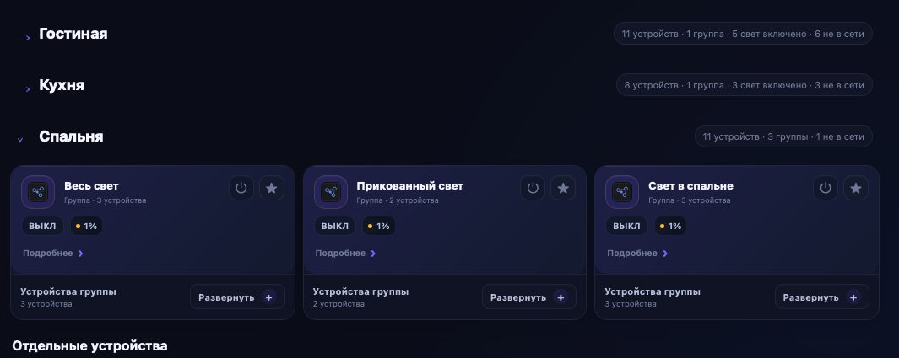
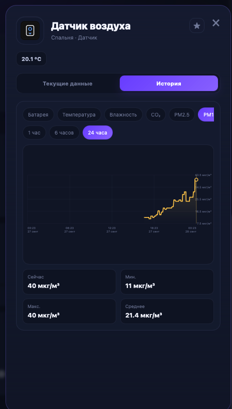

# Яндекс Умный дом [n-bord] для Stream Dock


Неофициальный плагин для управления **Яндекс Умным домом** через **Stream Dock** на macOS. Плагин умеет работать как с кнопками и крутилками Stream Dock, так и через отдельную панель управления домом.

> **Неофициальный любительский проект.** Проект не связан с компанией Яндекс и сервисом «Умный дом» от Яндекса и не поддерживается ими. Все упомянутые товарные знаки принадлежат их правообладателям.

**Автор:** [n-bord](https://github.com/n-bord)  
**Репозиторий:** https://github.com/n-bord/yandex-smart-home-stream-dock  
**Текущая публичная версия:** `1.0.0`

## Возможности

### Панель умного дома

- единая панель устройств, комнат, групп и сценариев;
- светлая и тёмная тема;
- режимы карточек **Компактный / Обычный / Информативный**;
- поиск и фильтрация по комнатам и типам устройств;
- избранное;
- скрытие устройств;
- ручная сортировка комнат, устройств, избранного и сценариев;
- сохранение пользовательского порядка и состояния интерфейса;
- управление группами и устройствами внутри групп;
- отображение mixed-state для групп, когда устройства имеют разные состояния;
- отдельная панель подробного управления устройством;
- автообновление панели с настраиваемым интервалом;
- выбор стартовой вкладки;
- диагностика подключения и backend;
- полный сброс локальных данных плагина.

### Свет

- включение и выключение;
- яркость;
- температура белого света;
- RGB / HSV, если поддерживается устройством;
- доступные цветовые сцены и пресеты;
- определение возможностей конкретной лампы по `capabilities`, а не только по типу устройства;
- управление цветом и температурой света в группах совместимых ламп.

### Устройства и датчики

Поддержка интерфейса строится по возможностям, которые возвращает API Яндекс Умного дома. В зависимости от конкретного устройства могут быть доступны:

- розетки и выключатели;
- лампы, ленты, люстры и другие источники света;
- шторы;
- вентиляторы;
- очистители и климатические устройства;
- чайники;
- пылесосы;
- телевизоры и ИК-устройства;
- Яндекс Станции и медиаустройства;
- кнопки и датчики;
- числовые показатели: температура, влажность, CO₂, PM2.5, PM10, TVOC, давление, батарея и другие свойства.

### История показателей

Плагин сохраняет локальную историю числовых показателей на Mac и показывает:

- периоды **1 час / 6 часов / 24 часа**;
- интерактивный график;
- текущее, минимальное, максимальное и среднее значение;
- время минимума и максимума;
- изменение показателя за выбранный период;
- историю не только отдельных датчиков, но и устройств с числовыми свойствами — например чайников и очистителей воздуха.

> История является локальной. Публичный API Яндекс Умного дома предоставляет текущее состояние, поэтому временной ряд накапливает сам плагин после установки.

### Сценарии

- просмотр сценариев из Яндекс Умного дома;
- запуск из панели;
- запуск с кнопки Stream Dock;
- выбор сценария вращением совместимой крутилки и запуск нажатием;
- отдельный пользовательский порядок сценариев;
- избранные сценарии.

### Кнопки, крутилки и информационные экраны Stream Dock

В комплект входят действия для стандартных контроллеров Stream Dock:

| Действие | Контроллер |
|---|---|
| Устройство — Вкл/Выкл | Keypad |
| Свет — Вкл/Выкл | Keypad |
| Свет — Яркость | Knob |
| Свет — Температура | Knob |
| Свет — Цвет | Keypad / Knob |
| Свет — Пресет | Keypad |
| Датчик — Показание | Keypad / Information / SecondaryScreen |
| Датчик — Показатели | Keypad / Knob / Information / SecondaryScreen |
| Шторы — Положение | Knob |
| Пылесос — Скорость | Knob |
| Очиститель / Вентилятор | Knob |
| Чайник — Температура | Knob |
| Телевизор / ИК — Громкость | Knob |
| Телевизор / ИК — Каналы | Knob |
| ИК / Пульт — Команда | Keypad |
| Умный дом — Панель / Сводка | Keypad / Information / SecondaryScreen |
| Сценарий — Запустить / Крутилка | Keypad / Knob |

Интервал обновления информации на кнопках и крутилках настраивается отдельно от обновления основной панели.

## Скриншоты

### Панель — тёмная тема


### Панель — светлая тема


### Группы устройств



### История датчиков



## Совместимость

### Поддерживается сейчас

- **macOS**
- совместимые устройства **Stream Dock**, использующие стандартные контроллеры `Keypad`, `Knob`, `Information` и `SecondaryScreen`.

Плагин не привязан к одной конкретной модели. На устройствах без крутилок knob-действия просто не используются, а клавишные действия продолжают работать.

### Протестировано

- **macOS Sequoia 15.7.3**
- **Stream Dock 3.10.203.0730**
- **miraBox N4**

Работа на других совместимых моделях предполагается архитектурой плагина, но первый публичный релиз проверен именно на конфигурации выше.

### Windows

Версия для Windows **планируется**, но релиз `1.0.0` предназначен для macOS.

## Установка

1. Откройте раздел [Releases](https://github.com/n-bord/yandex-smart-home-stream-dock/releases).
2. Скачайте архив релиза для macOS.
3. Распакуйте `com.nbord.yandexsmarthome.streamdock.sdPlugin`.
4. Установите плагин стандартным способом для локальных плагинов Stream Dock и при необходимости перезапустите Stream Dock.
5. Откройте **Яндекс Умный дом [n-bord] → Настройки → Подключение**.
6. Добавьте OAuth-токен Яндекса и выполните проверку.

## Подключение к Яндексу

Для работы плагину нужен OAuth-токен с доступами к API Умного дома.

В настройках OAuth-приложения используйте разрешения:

- `iot:view`
- `iot:control`

Для ручного получения токена можно использовать Redirect URI:

```text
https://oauth.yandex.ru/verification_code
```

URL авторизации имеет вид:

```text
https://oauth.yandex.ru/authorize?response_type=token&client_id=ВАШ_CLIENT_ID&force_confirm=yes
```

После авторизации можно вставить в плагин:

- сам `access_token`, либо
- полный URL результата OAuth с `access_token` и `expires_in`.

Если передать полный URL, плагин дополнительно сохранит известный срок действия токена и покажет его в разделе подключения.

> Никогда не публикуйте OAuth-токен в Issues, логах, скриншотах или сообщениях.

## Настройки

В разделе **Настройки** доступны:

- интервал обновления основной панели;
- отдельный интервал обновления кнопок и крутилок Stream Dock;
- стартовая вкладка;
- подключение и проверка OAuth;
- информация о сроке токена, если она была получена вместе с `expires_in`;
- диагностика;
- режим отладки;
- полный сброс плагина.

Настройки вида карточек, темы и отображения скрытых устройств доступны в боковой панели соответствующих рабочих разделов.

## Полный сброс

Встроенный полный сброс очищает локальные данные плагина, включая:

- OAuth-авторизацию;
- локальную историю показателей;
- статистику;
- кэш;
- избранное;
- скрытые устройства;
- пользовательский порядок комнат, устройств и сценариев;
- параметры интерфейса;
- локальные настройки действий кнопок и крутилок;
- диагностические и временные данные плагина.

После полного сброса плагин возвращается к состоянию новой установки.

## Диагностика

Раздел диагностики помогает проверить:

- состояние backend;
- доступ к API;
- настройки OAuth;
- период обновления кнопок и крутилок;
- журнал ошибок;
- безопасные автоматические проверки плагина.

Для обычной работы режим отладки включать не требуется.

## Конфиденциальность

- OAuth-токен используется для запросов к API Яндекс Умного дома.
- История показателей и пользовательские настройки хранятся локально на компьютере.
- Не публикуйте токен и другие приватные данные вместе с диагностическими материалами.

## Известные ограничения

- `1.0.0` — первый публичный релиз и пока официально протестирован только на macOS и miraBox N4;
- набор доступных действий зависит от возможностей конкретного устройства, возвращаемых API;
- локальная история начинает накапливаться только после установки и запуска плагина;
- поддержка Windows пока не входит в релиз `1.0.0`.

## Сообщить об ошибке или предложить улучшение

Используйте [GitHub Issues](https://github.com/n-bord/yandex-smart-home-stream-dock/issues).

При описании проблемы желательно указать:

- версию плагина;
- версию macOS;
- версию Stream Dock;
- модель устройства Stream Dock;
- тип устройства Яндекс Умного дома;
- шаги воспроизведения;
- скриншот;
- диагностическую информацию без OAuth-токена.

## Автор

**nbord / n-bord**

- GitHub: https://github.com/n-bord
- Проект: https://github.com/n-bord/yandex-smart-home-stream-dock

## Дисклеймер

**Яндекс**, **Умный дом**, названия продуктов и другие упомянутые товарные знаки принадлежат их правообладателям.

Этот проект является независимым неофициальным любительским решением, не аффилирован с компанией Яндекс и не поддерживается ею.
